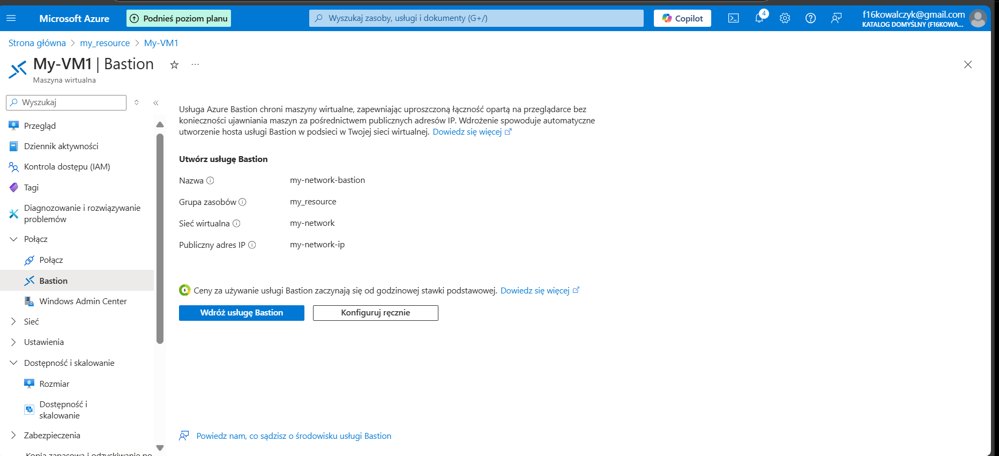
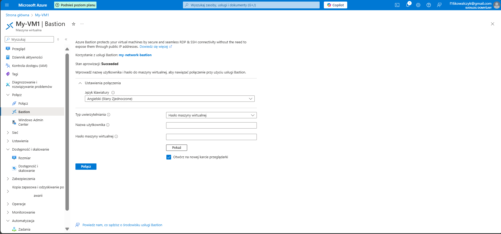
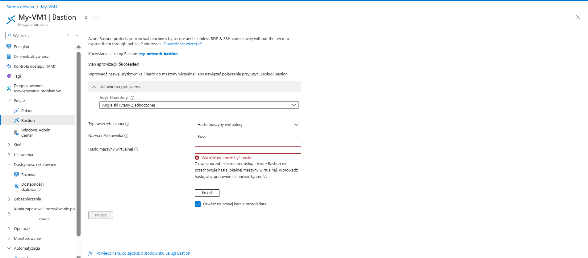
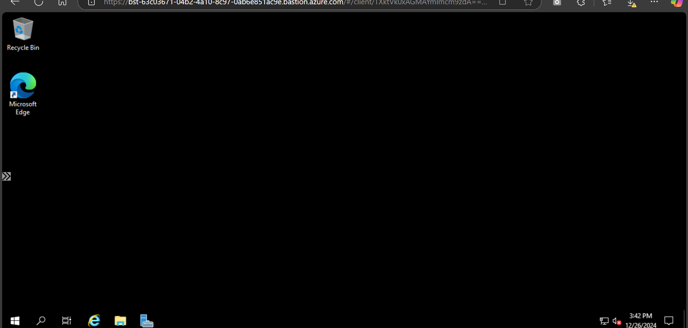

# AZ_Ports
 How to use ports

 3389 - RDP

 22 - SSH

Close all and use Bastion

 Bastion

 Go to resourse and go to Bastion

 

Next create user and password

Next type login and password

now you are login

For connect use rdp and ip this machine or use web browser.